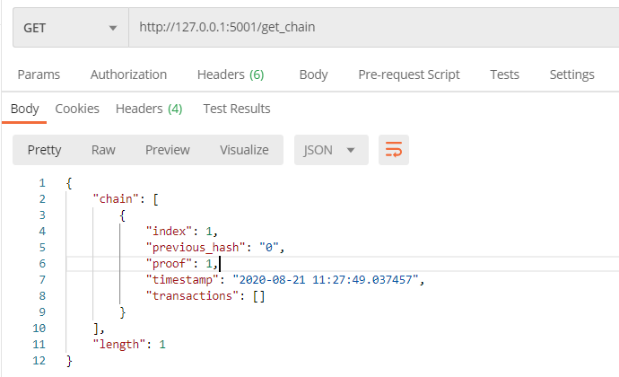
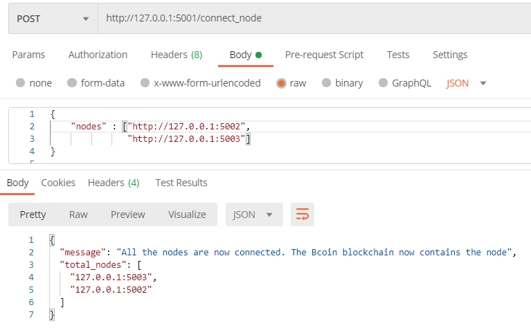
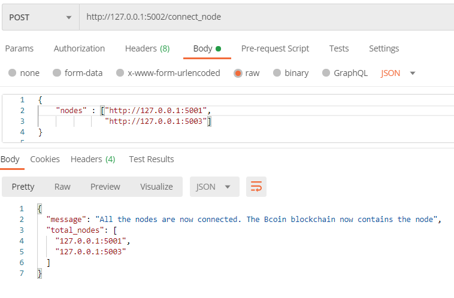
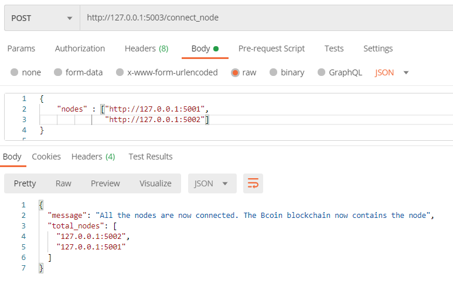
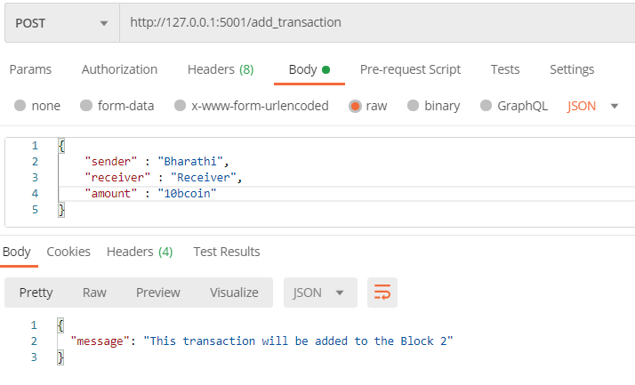
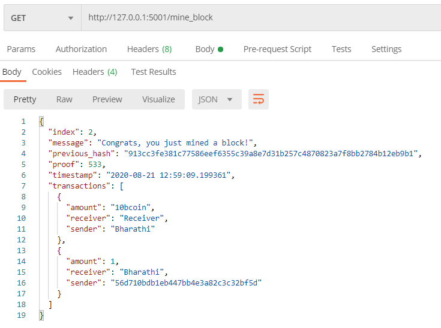
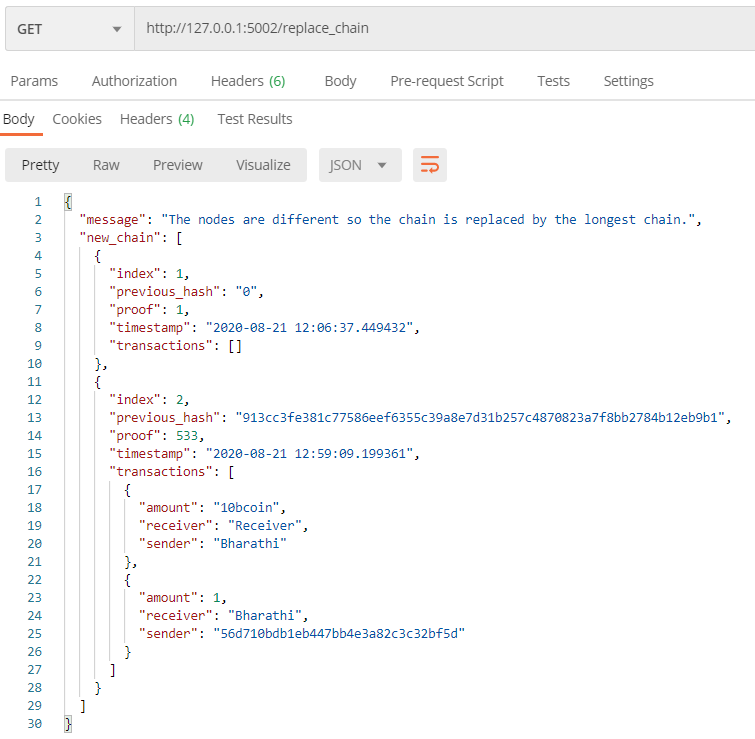

# `Bcoin`
- A simple implementation of a cryptocurrency in python made on top of blockchain technology.
- It is a simple working blockchain cryptocurrency and to be used as an educational material.

## `Blockchain`
> - A blockchain is a digital record of transactions. The name comes from its structure, in which individual records, called blocks are linked together using cryptographic principles in single list, called a chain.

- The blockchain network has no central authority.
- The information in it is open for everyone to see.

- Main Properties of blockchain for its popularity
    - `Decentralization`
    - `Transperancy`
    - `Immutability`

Find more information in the [original paper](https://bitcoin.org/bitcoin.pdf).

Take a look at the original [bitcoin repository](https://github.com/bitcoin/bitcoin).

## Requirements
- `Python 3.x`
- `Flask`
- `Requests`
- `Postman`
 
## How to run it
Install [Python 3.x](https://www.python.org/) and [Postman](https://www.postman.com/) in your local machine.

Install flask and requests through pip(python package installer) in your command prompt.
- Example

    ```
    pip install flask
    ```

Clone this repository `https://github.com/bharathikannan1311/bcoin.git`

- After cloning just go into the folder and run the bcoin.py file.
    - Example
    ```
    C:\Users\BHARATHI KANNAN.N\Desktop\bcoin>python bcoin.py
    * Serving Flask app "bcoin" (lazy loading)
    * Environment: production
   WARNING: This is a development server. Do not use it in a production deployment.
   Use a production WSGI server instead.
    * Debug mode: off
    * Running on http://0.0.0.0:5001/ (Press CTRL+C to quit)
    ```

- Then open your postman desktop app and test your application.
    - Example

    

## How this code works
`bcoin.py`

- Running the file will create a node. It will create a genisis block at first and then you can add transactions and mine the block. As a reward for this you will receive some coins.
    - Consensus Mechanism - `Proof of work`

`bccoin_node_5001.py`<br>
`bccoin_node_5002.py`<br>
`bccoin_node_5003.py`

- Running these files seperately will create three nodes in your local machine.
- Connect these nodes in the post man using the POST request in postman 

    
    
    

### `Adding Transactions`
- Transaction can be added as a post method in postman

    

### `Mining the block`   
- We can then mine the block and we will be rewarded with some bcoin.

    

### `Updating the nodes`

- Since it is a distributed system if one block mines and update the chain all other nodes should update their chain.
- We will replace the chain with the longest valid chain by checking all other nodes otherwise we will not update.

    

## `Bcoin Blockchain`

```JSON
{
  "chain": [
    {
      "index": 1,
      "previous_hash": "0",
      "proof": 1,
      "timestamp": "2020-08-21 12:06:37.449432",
      "transactions": []
    },
    {
      "index": 2,
      "previous_hash": "913cc3fe381c77586eef6355c39a8e7d31b257c4870823a7f8bb2784b12eb9b1",
      "proof": 533,
      "timestamp": "2020-08-21 12:59:09.199361",
      "transactions": [
        {
          "amount": "10bcoin",
          "receiver": "Receiver",
          "sender": "Bharathi"
        },
        {
          "amount": 1,
          "receiver": "Bharathi",
          "sender": "56d710bdb1eb447bb4e3a82c3c32bf5d"
        }
      ]
    },
    {
      "index": 3,
      "previous_hash": "063c0a4b20355ec7a63402ebdb5acd9829fa33ac00b4631046b268fad780d3ee",
      "proof": 45293,
      "timestamp": "2020-08-21 13:16:49.391491",
      "transactions": [
        {
          "amount": "15bcoin",
          "receiver": "Naveen",
          "sender": "Bharathi"
        },
        {
          "amount": 1,
          "receiver": "Bharathi",
          "sender": "56d710bdb1eb447bb4e3a82c3c32bf5d"
        }
      ]
    },
    {
      "index": 4,
      "previous_hash": "881ad3ccebbe6f2ffb48e8ed295a1f47aa12c766b5fffab0a85501c23d74976a",
      "proof": 21391,
      "timestamp": "2020-08-21 13:18:49.014229",
      "transactions": [
        {
          "amount": "20bcoin",
          "receiver": "Naveenraja",
          "sender": "Bharathikannan"
        },
        {
          "amount": 1,
          "receiver": "Bharathi",
          "sender": "5b4fb2883b7c4497b5076696cc57d7d9"
        }
      ]
    },
    {
      "index": 5,
      "previous_hash": "a8a887acffbe477c293019b5e33829aa55d848bb726743beb0233e5b518f5b3e",
      "proof": 8018,
      "timestamp": "2020-08-21 13:20:26.953987",
      "transactions": [
        {
          "amount": "25bcoin",
          "receiver": "Naveenraja",
          "sender": "Bharathikannan"
        },
        {
          "amount": 1,
          "receiver": "Bharathi",
          "sender": "68aae997dc6a4c7da90a109586d019d3"
        }
      ]
    }
  ],
  "length": 5
}
```